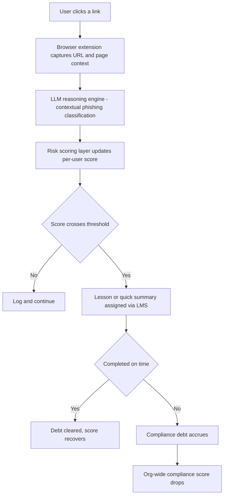

# 🎣 InLuna

**Most phishing filters stop at "blocked." This one asks: now what?**


## Why this exists

Every phishing tool does the same thing: classify a URL, throw up a red banner, done. The user who almost clicked walks away having learned nothing, and the organization has no record it ever happened.

InLuna treats every flagged click as a training signal instead of a dead end — pairing real-time detection with an automatic, trackable remediation loop that rolls all the way up into an org-wide compliance score.

## What it does

- **Real-time detection** — flags malicious sites the moment a user visits or clicks one, via a browser extension
- **LLM reasoning engine** — classifies sites through contextual, language-model-driven analysis instead of a fixed feature set, so it isn't limited to the patterns it was originally trained on
- **Per-user risk scoring** — every flagged interaction updates a continuous risk score, not a binary blocked/allowed
- **Compliance debt** — cross a risk threshold and InLuna auto-assigns a remediation lesson or quick-read summary. Skip it, and the debt doesn't vanish — it rolls up into the organization's overall compliance score
- **LMS integration** — every assignment, completion, and missed deadline is tracked, so security teams get an audit trail instead of a guess

## How it works



## The research behind it

**Phase 1 — MSc thesis.** Built an end-to-end detection pipeline in Python on ~11,430 labelled URLs (87 features), benchmarking six classifiers — Logistic Regression, Decision Tree, Random Forest, SVM, KNN, Naive Bayes — plus a voting ensemble, across accuracy, precision, recall, F1, and ROC-AUC.

| Metric | Random Forest (best performer) |
|---|---|
| Accuracy | 96.9% |
| Precision | 97.5% |
| ROC-AUC | 0.994 |

Deployed behind a Flask REST API with a Chrome extension delivering real-time verdicts.

**Phase 2 — Cooperative extension.** Rebuilt as a full MERN-stack platform. Replaced the Random Forest classifier with an LLM-based reasoning engine to test contextual inference against the original supervised baseline, then layered in the risk-scoring and compliance-debt mechanics that turn a single detection event into an organization-wide feedback loop.

## Tech stack

**Legacy detection engine:** Python · scikit-learn · Flask · PythonAnywhere
**Platform:** MongoDB · Express · React · Node.js · LLM API · Chrome Extension APIs

## Getting started

Adjust paths and scripts below to match your actual project layout.

```bash
git clone [https://github.com/Phishblockr/Project_InLuna.git]
cd <repo-name>

# Backend
cd server && npm install && npm run dev

# Frontend
cd ../client && npm install && npm start

# Browser extension
# chrome://extensions -> Enable Developer Mode -> Load unpacked -> select /extension
```

## Roadmap

- [ ] Publish the LLM-vs-Random-Forest benchmark comparison
- [ ] Org-level compliance dashboard
- [ ] Configurable risk-score thresholds per organization
- [ ] Broaden LMS/SCORM compatibility

## Author

**Ronit Yadav**
MSc Cybersecurity, Anglia Ruskin University
Bug Bounty Hall of Fame: Microsoft, Adobe, Atlassian, US Department of Defence
**Pranav Dalvi**
**Pratham Shinde**
**Aditya Paluskar**
## License

MIT — swap for whatever you're actually using.
